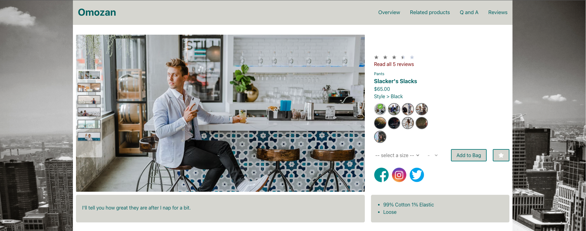
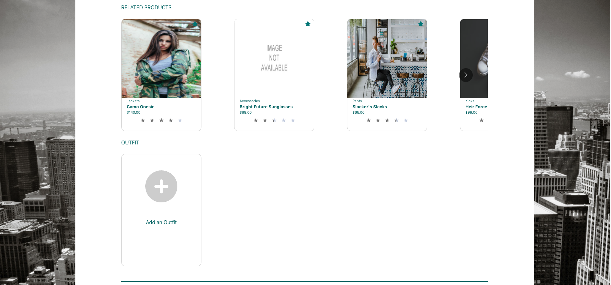
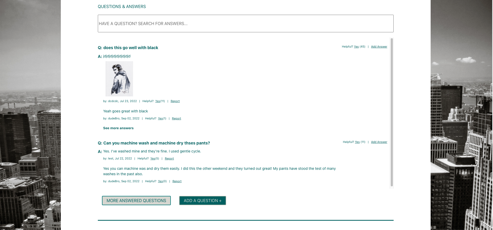
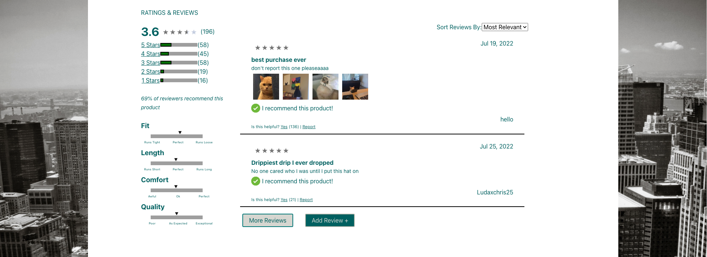

<div id="top"></div>

# Project Atelier

## Overview

Project Atelier is a website built with React, Express, and Webpack which used an API and business requirements that were set by stakeholders. Our engineering team of four worked on four seperate components on the site: Product Overview, Related Products/Outfit, Questions & Answers, and Ratings & Reviews. The first phase of our development was acclimating to project management tools we had not previously used in depth, such as the Git Feature Branch Workflow and Trello. We used an agile scrum methodology and held two daily standups to keep track of each member's progress on the sub-components of the product as well as rotated group leader each sprint. The strengths of this product are a functional and intuitive user experience as well as its sleek and consistent design. Our team challenged ourselves by learning new technologies, including styled-components, React Hooks, and Jest testing.

## Table of Contents

  - [Tech Stack](#tech-stack)
  - [Features](#features)
    - [Product Overview](#product-overview)
    - [Related Products and Outfit](#related-products)
    - [Questions and Answers](#questions-&-answers)
    - [Ratings and Reviews](#reviews)
  - [Development](#development)
    - [Pre-Installation Requirements](#pre-installation-requirements)
    - [Config Variables](#config-variables)
    - [Installation](#installation)
  - [Deployment](#deployment)
  - [Team Members](#team-members)

## Tech Stack
  * React
  * Node
  * Webpack
  * Express
  * Jest
  * Babel
  * Font Awesome
  * Axios
  * Eslint
  * Styled Components
  * AWS

## Features

  ### Product Overview

  > This is the first widget the user will see on page render. It shows a large carousel of images of the current product as well as a selection of different styles for that product. Also includes a description, price, facts, and social media links.

  

  ### Related Products

  > This is where the user will see a carousel of products related to the product displayed in the overview. It also includes an "add outfit" functionality to add the current product to "Your Outfit".

  

  ### Questions & Answers

  > This is where the user can see a question list of all questions related to the current product as well as add their own question(s). Each question shows a list of answers below it with a functionality for the user to add their answers also.

  

  ### Reviews

  > This is where all product reviews are listed for the current product. It also shows an average star rating out of 5 stars and a graph visual to show what the consensus characteristics of the product are.

  

## Development

  ### Pre-Installation Requirements

  ```
  Node
  NPM or Yarn
  ```

  ### Config Variables

  This project uses a config.js file containing config variables necessary to run the application.

  Please reference the `example.config.js` file and modify the variable found in this file with your own valid GitHub Token in a new `config.js` file.

  ### Installation

  From the root directory, run the following commands in your terminal:

  1. Install packages:

  ```
  npm install OR yarn
  ```

  2. To initialize Webpack & Bundle:

  ```
  npm run build OR yarn run build
  ```

  3. To start the server:

  ```
  npm run server OR yarn run server
  ```

  4. To automatically compile changes into the bundle file:

  ```
  npm run start OR yarn run start
  ```

## Deployment

The website is currently deployed in AWS EC2 [here](http://13.58.172.92:3000/)


## Team Members

* [Nick Adam](https://github.com/nicholaspix) - Questions & Answers
* [Chris Garcia](https://github.com/Chrisgood2go) - Related Products/Outfit
* [Nick Kozlarek](https://github.com/Nkozlare) - Product Overview
* [Cathy Mosinski](https://github.com/CatMo9) - Reviews


<p align="right">(<a href="#top">back to top</a>)</p>

